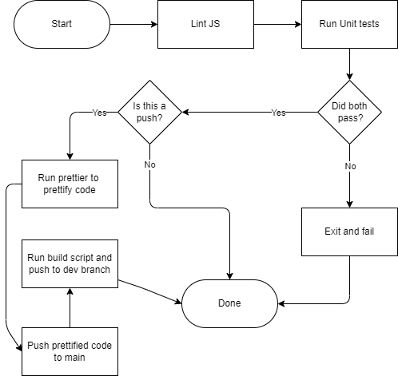

<<<<<<< HEAD
# CI/CD Pipeline Design
Our CI/CD pipeline consists of four phases as of now:

1) Running ESLint
2) Running Jest with our unit tests
3) Running Prettier to force consistent styling
4) Pushing to a dev branch

If both of these checks pass, then we move on to a build script that organizes our JS files into a branch that GitHub Pages builds off of.
=======
Our CI/CD pipeline consists of 3 phases as of now:

1) Running ESLint
2) Running Jest with our unit tests
3) Build and push to dev

When code is pushed to a branch and a pull request is made, the first two checks are ran on the code. The first check assesses the style of the code and makes sure it adheres to a consistent format. If it does not adhere to the styles we decide to use for our project, it automatically rejects the code and doesn't allow merging. After the style check is passed, the unit tests are ran on the code. We are using Jest to do our unit tests, and it runs all of the tests in the `/tests` directory. If the tests pass, then the code is allowed to be merged into main. 

Once code is merged with main, the build script mirrors the `/src` directory to the `/docs` directory on the `dev` branch. GitHub Pages is being built off of this branch, so a live version of the website is immediately visible when code is pushed to main. 
>>>>>>> 3c59b8e5148058e2e3ba9d695959e3d46020e0e2

This behavior is illustrated in this diagram:

As you can see in the diagram, we only run the script that builds the site if there was a push to the main branch, as we don't want to build the site every time someone makes a pull request.

This action runs every time someone makes a pull request or pushes to main.

<<<<<<< HEAD
We don't run the prettifier on pull requests, but when they get merged, the code pushed to main will have the prettifier automatically ran on it.

As of now, any building steps are not implemented, because we do not yet have a website to build.
=======
All of the CI/CD pipeline functions are currently implemented in the GitHub Actions
>>>>>>> 3c59b8e5148058e2e3ba9d695959e3d46020e0e2
