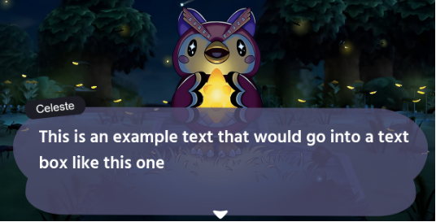
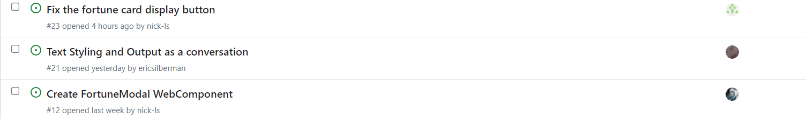

# Meeting Minutes on 5/28/2023

##Attendance
- Nick
- Quanling
- Yuning
- Shishir
- Eric
- Rui
- Sindhu

##Agenda
- Sprint review
  - Go over work and accomplishments
  

## Detail
- Sprint review details
  - Quanling: Manage meeting notes, add sign-wise fortune responses in different categories and sign-specific features and information. Also created a set of response generators that takes in a sign and generates responses accordingly. Working on the displacement of generated fortunes from localstorage and stay hidden and displayed on click.
  - Yuning: Helping to hold random stuff for the group, researching for the different astrology catalogs, making texts for the fortune responses, helping to fix the fortune response generators. Working on the leaf clicking display.
  - Shishir: Added the FortuneCard webcomponent (with proper styling and data). Will integrate its functionality with the rest of the website soon (i.e. cards get displayed when the green leaf icon is clicked). Will also do work on the FortuneModal component.
  - Eric: Figma, adding small details to text: Add “speech”: text animation, Add text wrapping: scroll or multipage
  - Rui: Added delete fortune card function, added get constellation function, integrate delete button to fortune card creation process and fixed related problems. Working on check-in system.
  - Sindhu: Getting caught up on some of the labs so I have the skills required for my tasks
  - Jianming: Added the background of the starting webpage and all the buttons to proceed to other functions of our app. Will finish the sequence of dialogue for Celeste.

- What we have done so far:
  - Basic layout of the web page
  - Web UI Design
  - Construction of Fortune card
  - Fortune card insertion
  - Fortune card deletion
  - Check-in system

- What we expect to done next week:
  - The completed astrology fortune flow
  - MVP done by Tuesday

