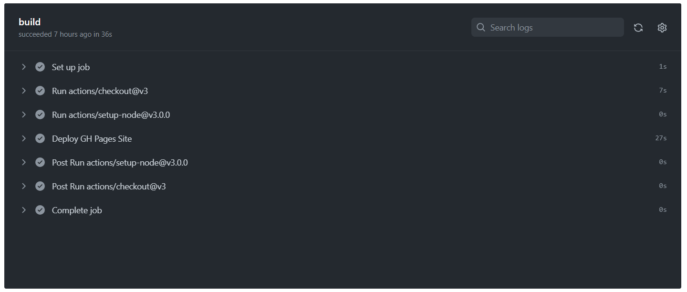
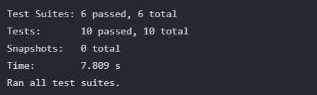

## How to access our website
#### The final project web link:
- https://cse110-sp23-group26.github.io/BugCatchers/

#### The final project github repo:
- https://github.com/cse110-sp23-group26/BugCatchers

## The features of our website
- Enter your birthday and current mood, and get your zodiac and a prediction for the future.
- - Allowed Input:  The real date, and the past year, and the current mood (can be any string)
- - Output: A short animation about your zodiac sign, a prediction of your future (randomly selected from thousands of JSON data, related to your horoscope)
- - 
- - 
- - 

- A fortune card list, which records all your fortune chat records (in the form of cards), and saves them in localstorage.
- - Click the top left corner green leaf button to open the fortune card list.
- - Allow card deletion
- - If click the card, a more detailed fortune model will appear
- - 
- - 
- - 

- A check-in system that allows you to check-in once a day (based on system time). The website will save your check-in times and last check-in time in localstorage.
- - 

- A localstorage system that saves all necessary user data and provides an interface for modifying, deleting, checking and modifying. Including: fortune card data, check-in date, check-in times, and the user's last birthday entered.
- - 

- An easter egg about Professor Powell
- - Try entering Powell into the Mood to trigger it!
- - 
- - 

## The Github Repo

#### Group documents:
- admin/branding/: save group branding
- admin/meetings/: Keep group meeting minutes
- admin/videos/: save group video recordings
- admin/temas.md: Save the group's profile

#### Project documents:
- specs/adrs/: Major decision records for the project
- specs/brainstorm/: Brainstorm records for projects
- specs/interface/: the appearance design record of the project
- specs/pitch/: Project introduction pitch
- specs/users/: user documentation
- specs/Roadmap.md: roadmap for the project

#### Project source code:
- src/assets/: Various image resources used by the project
- src/conf/: JSON file of the project, including nearly a thousand preset replies used to generate replies
- src/css/: the css file of the project
- src/fonts/: Font files for the project
- src/js/: Contains script files for web pages
- - src/js/main-app: The startup script file of the webpage, used to initialize the webpage. This file also manages updates to the fortune card list.
- - src/js/util/: Save the functional functions of the webpage, such as obtaining user input, obtaining the corresponding response according to user input, displaying output, updating localstorage, etc.
- - src/js/components/: Save the js of some custom elements of the webpage, such as fortune card, fortuneCardList, fortuneModel.
- src/index.html: the main html file of the web page
- tests/: test files.
- admin/ci pipeline/: the CI/CD pipeline

## The Process We Build The Repo (how your Agile practices were conducted)
- Auto build on push to the main branch.
  - To enable continuous integration and delivery, a build sequence will be triggered on push or merge on main branch.
  
- Auto unit testing and E2E testing on push.
  - Change in Repo will trigger both the unit testing for each individual components and a E2E test to make sure app works as expected.
    
- Linter is also used to ensure code correctness for continuous integration.
- Prettier is used for uniform code formatting and improved readbility.
- To enable fast iteration, we created a variety of issue labels such as feature request and bug with templates.

## The challenges
- Many people do not have the same free time each week, making it difficult to allocate appropriate meeting time
- Uneven distribution of tasks. Some people get a lot of quests, some people get few quests
- Without a reasonable, proper plan. We always start tasks at the last moment
- Insufficient understanding of the task. For example, our understanding of User Doc, Roadmap, etc. files are quite insufficient, which makes us quite confused when creating these documents and reduces the quality of our documents.
- Insufficient testing of the code. Our test cases are few and far between. We do not pay enough attention to this aspect.

## The victories
- Overall team communication is good.
- Everyone is working with full passion and highly focused on their own part, with great communication helps the connection between different sections.
- We didn’t blame others because of the mistakes we made, which gives everyone a safe psychological environment, so that we can fully exert our strength.
- The project is not just an MVP, but with a lot of details considered inside, even with an Easter egg design.

## Suggestions
#### What the taking over team needs to do:
- Add more unit test cases.
- Add more special effects.
- Complete the E2E test.

#### Our unfinished features
- another fortune teller based on tarot cards
- Smarter reply
- Improve CI/CD pipeline (more specific here)
