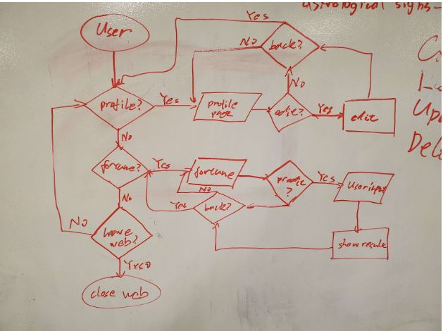
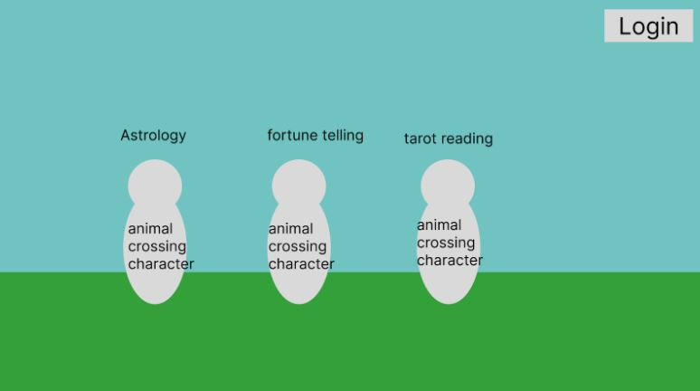
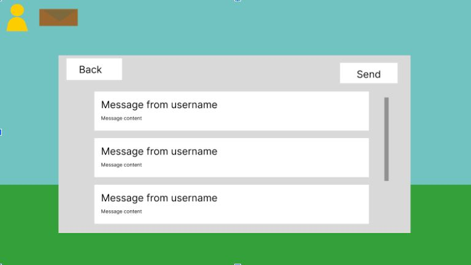
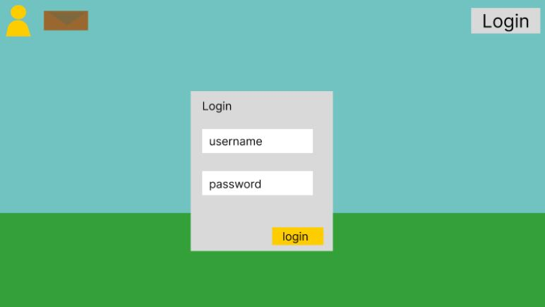
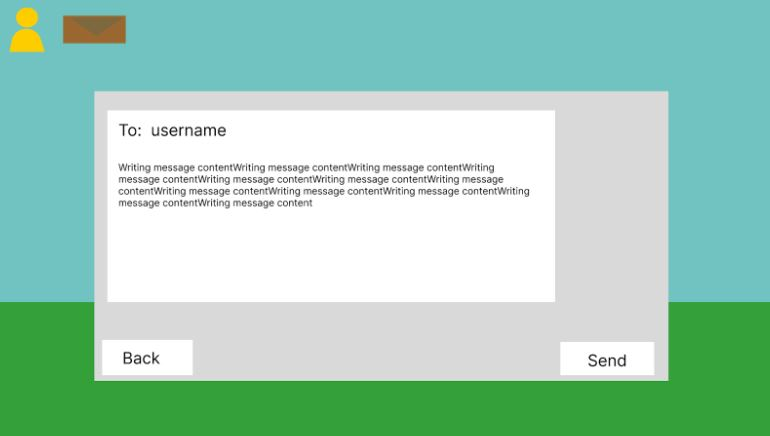
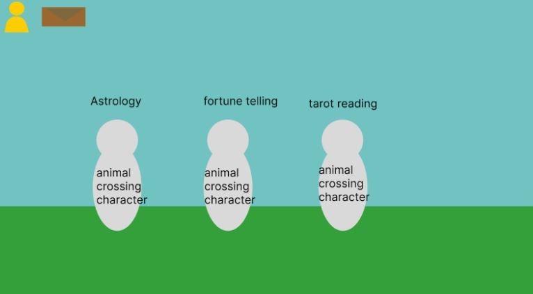
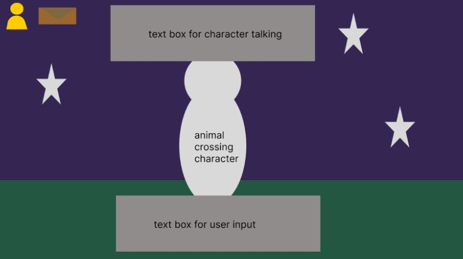

# App Pitch - FortuneTeller
##Team26: BugCatchers

## Statement of Purpose
We want to connect people through the platform of fortune telling and mysticism by using the widely celebrated Animal Crossing franchise. We want to inspire fun user experiences through an in-app sharing system where users can discuss their fortunes.

**Goals/Tasks:**
- Create a community through fortune telling and sharings.
- Connect people from different cultural background.

## Feaures / Functionalities
- Limited feature telling per day
  - Can increase by share fortune with other users
- Support personalizations on theme of the page
- store user profile
  - Age
  - Culture
- Generate response base on user profile.
- Different age groups will get different responses.
- Messaging between users to share fortune.
- Message board and mail system for user communication.

## User Persona
Characters:
- Person Group: First year UCSD Student with CS major
- Person Name: Bernard
- Age: 18
  - Goals: Gain more certainty about his future as a CS major - going to college for the first time can be a daunting experience!
  - Environment: Very comfortable with using a laptop, chronically online (he is a CS major after all); he will be discerning with the apps he uses
  - Needs: a fortune telling app that will give him meaningful answers to his questions and satisfy his various uncertainties (a simple magic 8 ball will not be enough)

## User Flow diagram

## Risks and rabit holes
- Risks
  - Potentially some repetition of fortunes (especially if staying local); mitigated somewhat by having a limited rate of fortunes
  - Fortune's replies may be too random to be smart
- Rabbit hole
  - Might go overboard with the whole messaging system
  - Best to keep it simple and focus more on the fortune telling aspect
  - Customization options (might not have enough time to implement a large variety of customization)
  - If we go too far for smart replies (without using connected AI), the feature will be too complex and we could be down a rabbit hole.
  - Too much pursuit of intelligent reply, let us fall into this complex demand that cannot be fulfilled

## CRUD components
- Create:
  - Accounts
  - Posts about fortunes
  - Messages
- Read:
    - Past fortunes
  - Messages
- Update:
    - Profiles
  - Fortunes
  - Messages
- Delete:
    - Posts about fortunes
  - Messages

# UI design
- Themed after Animal Crossing
- Use our team brandings.

# Tech
- Platform compatibility: Should be able to run on both a laptop and smartphone
- An average user would likely more typically use a smartphone (more of an on the go sort of app)
- Use 
