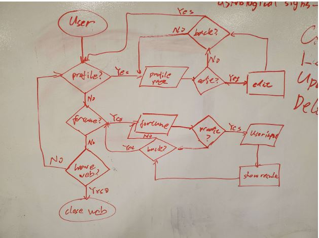
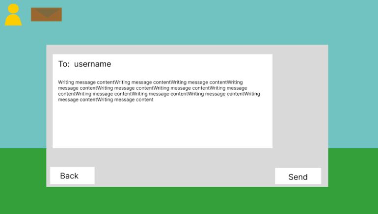
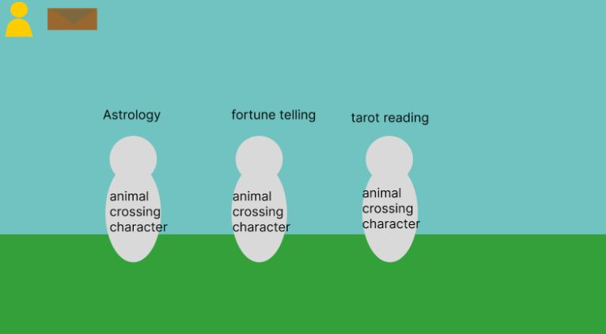
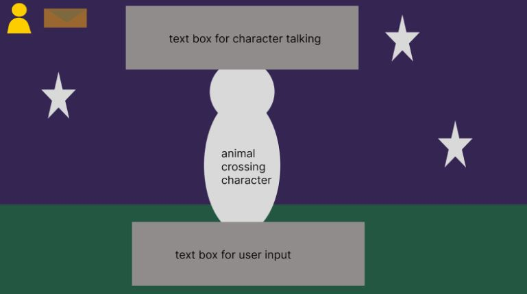

# App Pitch - FortuneTeller

## Team26: BugCatchers

## Statement of Purpose

Our web development project aims to create a unique social connectivity platform that operates completely locally. Unlike popular social media platforms such as Facebook, Twitter, and Instagram, which are heavily dependent on the internet and centralized servers, our platform operates within a localized network without the need for a connection to the internet.

The goal of our project is to create a space for people to connect, communicate and share content within a specific community, without the need for internet connectivity. By utilizing a local network, we aim to provide users with a more secure and private way to interact with others, without the risk of their personal information being stored on remote servers.

Each user can have an own account on a local public website. Each user can use their account to interact on the website and choose to share their interaction records on the homepage of the website.

**Goals/Tasks:**
- A main web page that guides users to log in, register, check personal information, and interact with site elements.
- A user profile page.
- A fortune telling page.
- An account management system.

## CRUD components
- Create:
  	- Users can create accounts, including setting account names and passwords.
	- Users can create new interaction records based on their interactions with the website.
	- Users can choose to publish their record of their interactions.
- Read:
    - Users can read their own personal information.
	- Users can read transcripts of interactions shared by others.
	- Users can read public elements of the site.
- Update:
    - Users can update their personal information.
	- Users can update their own interaction history.
- Delete:
    - Users can delete their own accounts.
	- Users can delete their own personal information.
	- Users can delete their own interaction records.

## Feaures / Functionalities
- Feature telling throgh different methods from different culture.
- Support personalizations on theme of the page
- store basic user information locally like age, culture
- Generate response base on user profile. i.e. Different age groups will get different responses.
- Educational, provided information and fun fact about culture.

## User Persona
Characters:

- Person Group: First year UCSD Student with CS major
  - Person Name: Bernard
  - Age: 18
    - Goals: Gain more certainty about his future as a CS major - going to college for the first time can be a daunting experience!
    - Environment: Very comfortable with using a laptop, chronically online (he is a CS major after all); he will be discerning with the apps he uses
    - Needs: a fortune telling app that will give him meaningful answers to his questions and satisfy his various uncertainties (a simple magic 8 ball will not be enough)

- Person Group: Working Professional
  - Person Name: Sarah
  - Age: 30
    - Goals: Struggling with work-life balance and feeling unsure about career path
    - Environment: Busy with work and personal responsibilities, frequently on-the-go and uses mobile devices for convenience
    - Needs: A quick and easy way to receive guidance and direction for both personal and professional matters

- Person Group: High School Student
  - Person Name: Jason
  - Age: 17
    - Goals: Planning for college and seeking guidance on academic and social challenges
    - Environment: Juggling schoolwork, extracurricular activities, and social life; frequently uses social media to connect with peers
    - Needs: A confidential way to seek guidance on college admissions, academic challenges, and social situations

- Person Group: Senior Citizen
  - Person Name: Margaret
  - Age: 70
    - Goals: Struggling with loneliness and seeking connection with others
    - Environment: Limited mobility and social isolation due to health conditions; uses a desktop computer for online communication and entertainment
    - Needs: A way to connect with others in a safe and supportive environment, and to receive guidance on personal and spiritual matters.

## User Flow diagram

## Risks and rabit holes

**Risks**

- Potentially some repetition of fortunes (especially if staying local); mitigated somewhat by having a limited rate of fortunes
- Fortune's replies may be too random to be smart

**Rabbit hole**

- Might go overboard with the whole messaging system
- Best to keep it simple and focus more on the fortune telling aspect
- Customization options (might not have enough time to implement a large variety of customization)
- If we go too far for smart replies (without using connected AI), the feature will be too complex and we could be down a rabbit hole.
- Too much pursuit of intelligent reply, let us fall into this complex demand that cannot be fulfilled

## UI design

## Similar Apps and Competition

The current mainstream Facebook and Twitter are both very heavy social media, that is, they are large in size, completely online, have many functions, but are also "bloated". Compared with them, the advantage of our app is that it is small in size, fully localized, independent of the network, and its security is still open to question (subject to our implementation). But the disadvantage is that there are few functions.

## Applicable platform
- Currently only desktop sites are considered. 
- If time enough, consider adapting to mobile platforms (such as mobile phones, ipads)
